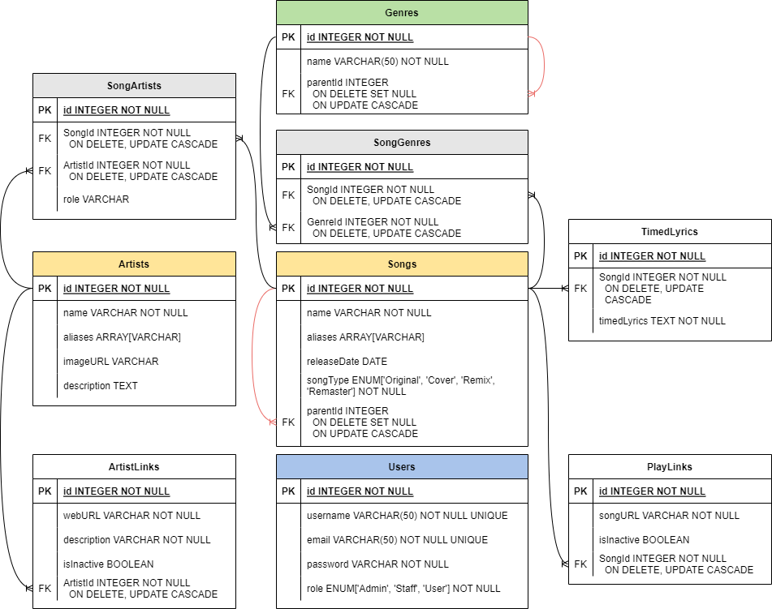

# LaguDB - Server

Lagu - Indonesian for "song".

Modelled after Last.fm, Discogs, and VocaDB, LaguDB is an aggregate platform for musical artists, songs, albums, and the like. With LaguDB you can follow your favourite artists and keep updated on their latest songs. In addition, LaguDB also has a novel feature - auto-timed lyrics, or lyrics that play along with the music video in real time. 

## Application Demo

## Tech Stack & Features

 - Monolithic Architecture (Express.js REST API)
 - PostgreSQL Database
 - ORM Sequelize
 - Google Login (OAuth)
 - CRUD (Create, Read, Update, Destroy) songs, albums, artists
 - Integration with Third Party APIs (YouTube Data and VocaDB public API)
 - Integration with the YouTube IFrame API on the front-end to render auto-timed lyrics

## Database Schema

