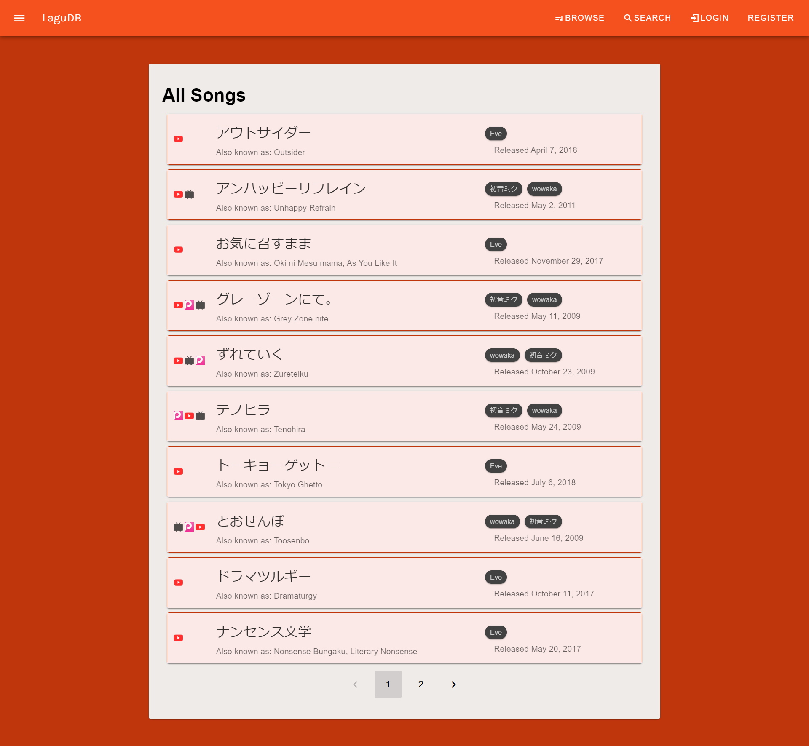
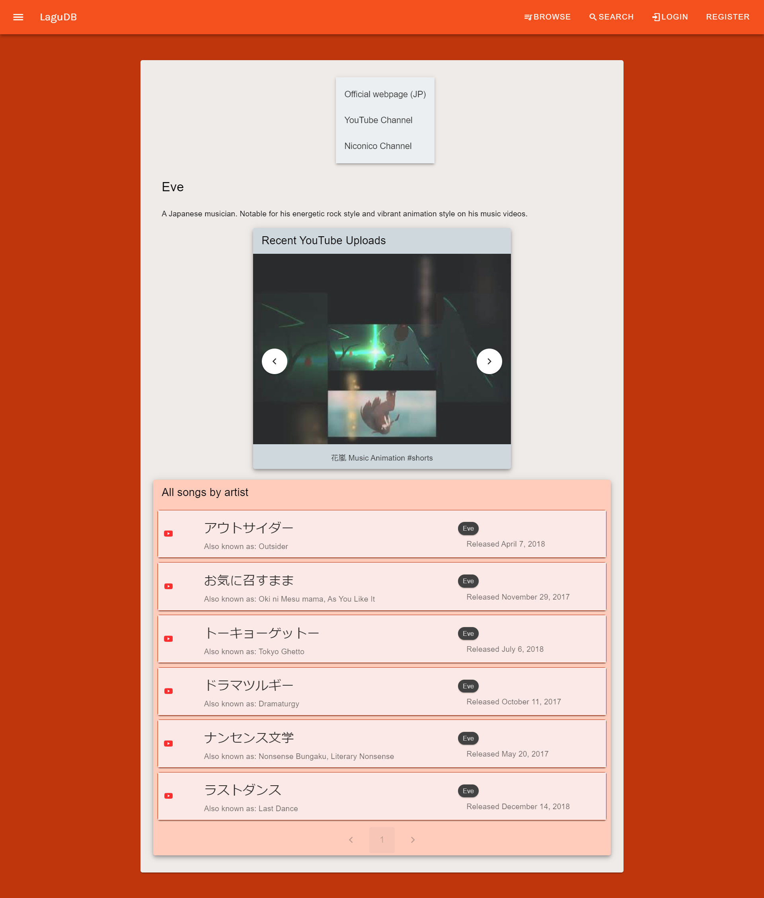

# LaguDB - Server

Lagu - Indonesian for "song".

Modelled after Last.fm, Discogs, and VocaDB, LaguDB is an aggregate platform for musical artists, songs, and the like. With LaguDB you can follow your favourite artists and keep updated on their latest songs. In addition, LaguDB also has a novel feature - auto-timed lyrics, or lyrics that play along with the music video in real time. 

API Documentation: [Link](api-documentation.md)<br>
Front-end Client (Vue) (proof of concept): [Link](https://github.com/ValYauw/lagu-db-vue-client)

## Application Demo

### Basic UI


### Browse Songs and Artists




### MVP - Lyrics change alongside the music


## Tech Stack & Features

 - Monolithic Architecture (Express.js REST API)
 - PostgreSQL Database
 - ORM Sequelize
 - Google Login (OAuth)
 - CRUD (Create, Read, Update, Destroy) songs, albums, artists
 - Integration with Third Party APIs (YouTube Data and VocaDB public API)
 - Integration with the YouTube IFrame API on the front-end to render auto-timed lyrics

## Database Schema


## How to run

```npm install```

Install packages and dependencies.

```bash dbsetup-sequelize.sh```

Migrates and seeds database in development and testing environments. [Requires sequelize-cli]

Database configuration options can be changed in `config/config.json`.

```npm run dev```

Start Node.js application.

```bash dbdrop-sequelize.sh```

Drops the database in development and testing environments. [Requires sequelize-cli]

```npm run test```

Run tests.

## Current State of Development (*October 11, 2023*)
 - Finished 28 entrypoints for CRUD (Create, Read, Update, Destroy).
 - Passed 164 unit tests with [85% coverage](__tests__/integration-test-results.PNG).
 - Finished a basic front-end web application showcasing read & search features and the auto-timed lyrics playback feature. 

## Stretch Goals
 - Database Optimization
 - UI Redesign of Front-end Code, possibly using React.js instead of Vue.js + Vuetify.